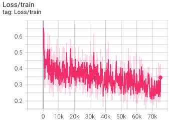

# NYCU Visual Recognition Deep Learning 2025 Homework 2
Student ID: 313551085  
Name: 謝振杰

## Introduction

This repository provides implementations for a digit recognition task using the Faster R-CNN framework with the FPN v2 backbone.  
The task consists of two subtasks:  
- **Task 1:** Detect and localize each individual digit in the image.  
- **Task 2:** Recognize the entire digit (i.e. the concatenated prediction of each detected digit).  

The project uses COCO-formatted annotation files and outputs two prediction files during inference:  
- `pred.json`: Contains object detection results for each bounding box in COCO format.  
- `pred.csv`: Contains the final digit prediction per image, generated by concatenating each predicted digit (with proper label conversion, e.g. category_id 1 represents digit 0).

The repository includes 3 different training scripts which vary mainly in learning rate scheduling and post-processing techniques:  

1. **train_inference.py**  
   A baseline training/inference script using standard settings, including basic data augmentation via ColorJitter.

2. **train_inference_cosine_lr.py**  
   This version employs a Cosine Annealing Learning Rate scheduler (with warmup) instead of step-based scheduling.

3. **train_inference_consine_lr_outlier.py**  
   In addition to CosineAnnealingLR, this version incorporates outlier filtering of bounding boxes using DBSCAN in the post-processing stage to remove detections that are not spatially consistent with the digit sequence.

All scripts are implemented in Python using PyTorch and Torchvision.

## Installation

Follow these steps to set up the project:

0. **Dev Container:**  
   This project has a VSCode dev container configuration attached. It's recommended to run this project inside dev container.

1. **Install Dependencies:**  
   Make sure you have Python 3.9 or higher installed. Then run:
   ```bash
   pip install -r requirements.txt
   ```

2. **Prepare Dataset**  
    Organize your dataset in the following directory structure:
    ```
    data/
    ├── train/
    │   ├── 1.png
    │   ├── 2.png
    │   └── ...      
    ├── valid/
    │   ├── 1.png
    │   ├── 2.png
    │   └── ...
    ├── test/
    │   ├── 1.png
    │   ├── 2.png
    │   └── ...
    ├── train.json
    └── valid.json
    ```
    The JSON files should follow the COCO format (with "images" and "annotations" keys).

## Usage
Each script accepts command-line parameters such as data path, number of epochs, logging directory, and for some scripts a bounding box loss weight parameter.

#### 1. Baseline: train_inference.py
- **Training:**
  ```bash
  python train_inference.py --mode train --data_path data --num_epochs 10 --log_dir logs
  ```
- **Inference:**
  ```bash
  python train_inference.py --mode inference --data_path data --model_path logs/fasterrcnn_epoch9.pth
  ```

#### 2. Cosine LR Scheduler: train_inference_cosine_lr.py
- **Training:**
  ```bash
  python train_inference_cosine_lr.py --mode train --data_path data --num_epochs 20 --log_dir logs
  ```
- **Inference:**
  ```bash
  python train_inference_cosine_lr.py --mode inference --data_path data --model_path logs/fasterrcnn_epoch9.pth
  ```

#### 3. Cosine LR with Outlier Filtering: train_inference_consine_lr_outlier.py
- **Training:**
  ```bash
  python train_inference_consine_lr_outlier.py --mode train --data_path data --num_epochs 20 --log_dir logs --bbox_loss_weight 2.0
  ```
- **Inference:**
  ```bash
  python train_inference_consine_lr_outlier.py --mode inference --data_path data --model_path logs/fasterrcnn_epoch9.pth
  ```

#### Visualization  Notebook
The `visualize.ipynb` notebook provides a simple, interactive environment to explore and visualize the augmentation of the dataset.

#### Logging and Evaluation
- The training scripts integrate **TensorBoard** logging. To monitor training progress (loss, mAP for Task 1, and accuracy for Task 2), run:
  ```bash
  tensorboard --logdir logs
  ```
- The evaluation is based on COCO evaluation for mAP and a custom accuracy metric for Task 2.

## Performance Snapshot

### Leaderboard Score:
My best model get a 0.8 accuracy and 0.38 mAP on the leaderboard.


### Training Curve
The model acheives the accuracy of 0.81 and mAP of 0.46 on the validation set.



## Homework Report
For detailed methodology, ablation studies, and further experimental results, please refer to [Homework 2 report](https://hackmd.io/@BiuKhQYzQWiL8hlM_0ac3w/BJ3Oxh301e).
